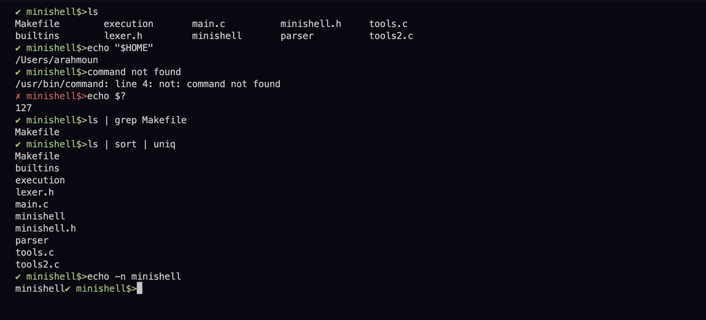

<h1>Minishell</h1>
 
<tr>
 
  
The goal of this project is to develop a basic shell using the C programming language, incorporating concepts such as file descriptors and processes that have been learned previously. made by <a href="https://github.com/rahmoun03">Ayoub Rahmoun</a>.
   
  <tr>
  
  
  <h3>The Project consist of two parts :</h3> 
<h4>Parsing</h4>

    1. readline
    2. pipes
    3. Command and arguments
    4. Protections
    5. The <,>, >> redirects
    6. Environment variables
    7. The separations
    8. history
 
<h4>The execution</h4>

    1. Redirects
    2. Env, export, unset
    3. Exit and $?
    4. Pipes / signals / process links 
